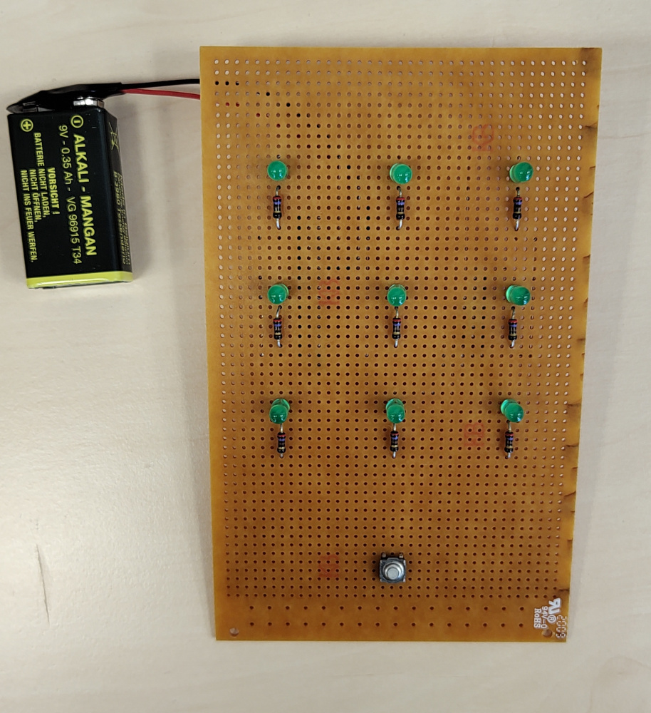
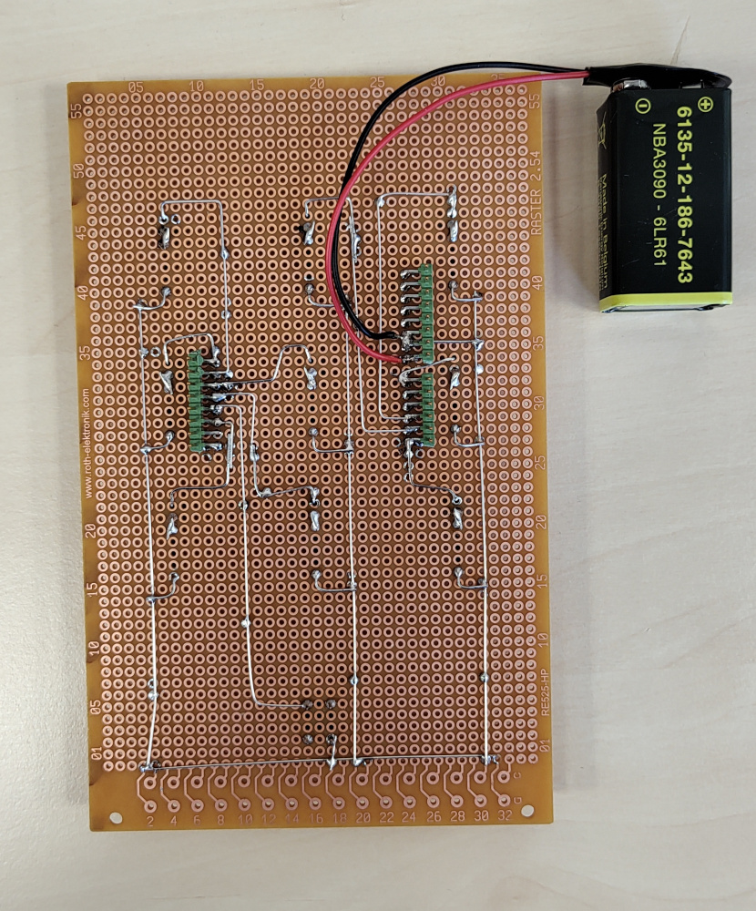

# Digital Dice
*Program for a Dice on Arduino Uno*

The Dice is built from 9 LEDs, which display the faces of the dice.
When the button is pushed an animation is played and a new face shown.
With the help of a 9V battery you can play on the go.

## Hardware

The project is powered by an Arduino Uno R3 that is connected to pin headers on the back side of the board.

The LEDs and the button are connected to the following pins:

    A3  A4   6
    A0   5   7
    A5   4   2
        (3)

Each LED has a resistor of 270Ω to limit the current.

The 9V battery is connected to the Vin pin.
To prevent backflow into the battery do not connect the battery and the USB cable at the same time.

## Software

The dice logic is implemented in the `Game` class.
The roll animation is created by the `Animation` class.

The seed of the generator of the random numbers is saved in the EEPROM and gets updated on every reset.
This ensures a different animation on every roll.
The random numbers are generated by Xorshift by default, but the generator can easily be changed.

The game loop runs 100 times a second.

## Licence

MIT-0

> MIT No Attribution
>
> Copyright 2023 Kontemplau
>
> Permission is hereby granted, free of charge, to any person obtaining a copy of this software and associated documentation files (the "Software"), to deal in the Software without restriction, including without limitation the rights to use, copy, modify, merge, publish, distribute, sublicense, and/or sell copies of the Software, and to permit persons to whom the Software is furnished to do so.
>
> THE SOFTWARE IS PROVIDED "AS IS", WITHOUT WARRANTY OF ANY KIND, EXPRESS OR IMPLIED, INCLUDING BUT NOT LIMITED TO THE WARRANTIES OF MERCHANTABILITY, FITNESS FOR A PARTICULAR PURPOSE AND NONINFRINGEMENT. IN NO EVENT SHALL THE AUTHORS OR COPYRIGHT HOLDERS BE LIABLE FOR ANY CLAIM, DAMAGES OR OTHER LIABILITY, WHETHER IN AN ACTION OF CONTRACT, TORT OR OTHERWISE, ARISING FROM, OUT OF OR IN CONNECTION WITH THE SOFTWARE OR THE USE OR OTHER DEALINGS IN THE SOFTWARE.
